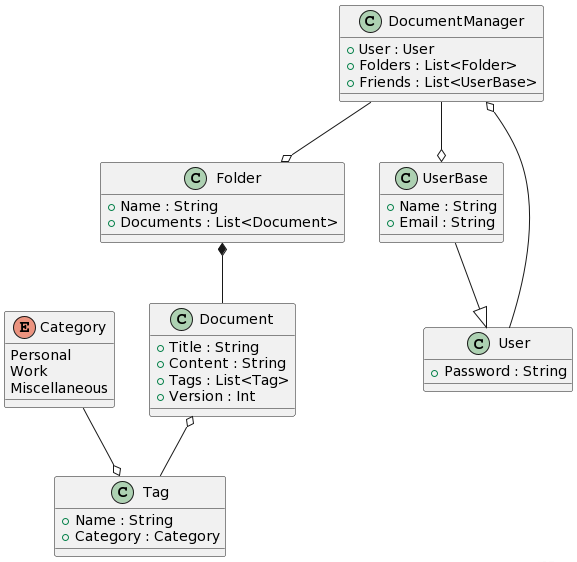

## POS Project DocumentManager
### Group members:
- Tristan Losada Benini, LOS20421@spengergasse.at
- Ruben Osmanovic, OSM21985@spengergasse.at

### Description:
- A Document(.txt/.md files) manager with Users
- The Document class represents a document and has one or more tags
- The Tag class represents a tag that has a category and can be assigned to one or more documents
- The User has the ability to share documents with other users(friends)
- The Folder contains documents
- The DocumentManager has a user "owner" that can influence the folders(and therefor documents) and other users(friends) interaction with those documents

### Domain Model (UML):

### To setup:
- netstat -ao (check if port 5432 is used somehwere else)
- taskkill /PID PID /T /F (purge all exisiting tasks to then run container)
- docker run -d --name postgres -e POSTGRES_PASSWORD=pwd -p 5432:5432 postgres:latest

### To test:
- run in Project folder:
  - dotnet test --verbosity (q/m/n/d)
