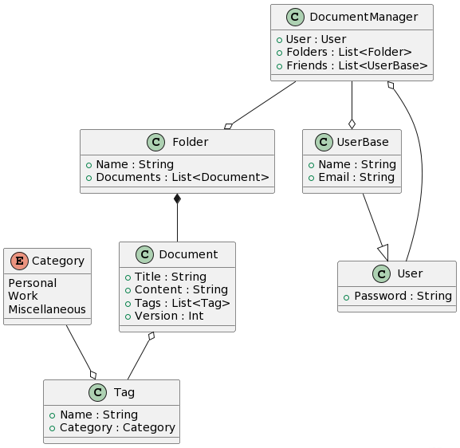

## POS Project DocumentManager
### Group members:
- Tristan Losada Benini, LOS20421@spengergasse.at
- (in Collaboration with Ruben Osmanovic, OSM21985@spengergasse.at)

### To setup:
- ```docker-compose build --no-cache``` (will take some time)
- ```docker-compose up -d```

### To Access:
- ```https://localhost/```
- Username: ```Admin```
- Password: ```admin```

### App Usage:
- First Login to be able to access the application
- Create an empty folder by clicking the folder-plus icon in the Sidebar
- Create a Document and choose your created folder
- You can edit the document by clicking on the folder icon in the home view, accessing the documents inside of the folder
- when editing a document make sure to choose the desired folder, if it is not selected you will not be able to save
--------------------------------------------

### Description:
- A Document(.txt/.md files) manager with Users
- The Document class represents a document and has one or more tags
- The Tag class represents a tag that has a category and can be assigned to one or more documents
- The User has the ability to share documents with other users(friends)
- The Folder contains documents
- The DocumentManager has a user "owner" that can influence the folders(and therefor documents) and other users(friends) interaction with those documents

### Domain Model (UML):




